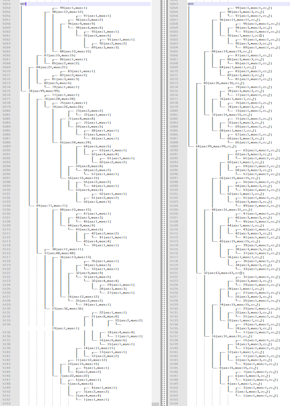

# codeforces-go 💭💡🎈

## Algorithm

I have implemented some algorithms in [copypasta](./copypasta).

## How to Choose Problems

> Notice that sorting problems by the rating also sorts problems with the same rating by solving amount. 
> So, I would say; Choose a rating; Sort by the rating; And, finally, start solving from the most solved problem.
>
> If you feel that rating X is easy enough for you, check if you can solve least solved problems with X rating. 
> Surely, you don't have to solve all problems with rating X, there are tons of them. Just step to X+100 when you feel ready.
>
> Good luck!
>
> [source](https://codeforces.com/blog/entry/65406?#comment-494043)

[Problem Difficulties](https://codeforces.ml/blog/entry/62865)

## Codeforces Solutions

[main](./main)

## Useful Tools

[Practice Problems Recommender](https://recommender.codedrills.io/)

[Contests Filter](https://codeforceshelper.herokuapp.com/contests)

[Codeforced](http://codeforced.github.io/handle/)

[Codeforces Upsolving Helper](https://codeforces-upsolving-helper.herokuapp.com/)

[UpSolve.me](https://upsolve.me/)

## Rating

[Open Codeforces Rating System](https://codeforces.com/blog/entry/20762)

[Codeforces Visualizer](https://cfviz.netlify.com/virtual-rating-change.html)

## Tips

[OEIS](https://oeis.org/)

[Wolfram|Alpha](https://www.wolframalpha.com/)

[Draw Geometry](https://csacademy.com/app/geometry_widget/)

[Draw Graph](https://csacademy.com/app/graph_editor/)

[Exercises!](https://musclewiki.org/)

> 1. Don't go to the editorial after some fixed time like 20 minutes of solving a problem. Give up only if you are stuck for 10-30 minutes (10 in case of easy problems, more for harder ones). As long as you have some ideas, do investigate them and maybe you'll solve the problem yourself.
> 2. Upsolving problems is very important. This way you learn new things. After a contest or virtual participation, try to solve at least one more problem. This should be said early in the PDF, not only in parts about getting red rating.
> 3. I don't think you should copy segment trees from your code library (reference document). It's better to struggle for some time and implement them every time. You will get faster and will understand them better. Plus this is a must for those who prepare for IOI. My friends and I implement seg-trees from scratch every time. I don't remember if I ever used to copy them.
> 4. It's unnecessary to do "50+ virtual participations in CF". Just solve problems slightly above your level. Do some virtual participations if you want to.
> 5. Consider changing "Make a routine that you will do just before the contest. It directly leads to the concentration during the contest." to "don't care about the contest, just have fun solving problems". I'm quite sure people perform better when they are relaxed (but not distracted).
> 6. "Although I experienced competitive programming for 3 years, I think that I don’t know many techniques" — I think that's because you're doing too much virtual participation. You spend a lot of time on easy problems this way.
>
> [source](https://codeforces.com/blog/entry/66909?#comment-517968)

## Others

My GoLand `Live Templates` and `Postfix Completion` [settings](./misc/my_goland_template)

[https://www.bilibili.com/video/av43450831](https://www.bilibili.com/video/av43450831)

[Markdown Paste](http://md.aclickall.com/)

## BST

> Binary search tree (BST) based data structures, such as AVL trees, red-black trees, and splay trees, are often used in system software, such as operating system kernels. 
> Choosing the right kind of tree can impact performance significantly, but the literature offers few empirical studies for guidance. 
> We compare 20 BST variants using three experiments in real-world scenarios with real and artificial workloads. 
> The results indicate that when input is expected to be randomly ordered with occasional runs of sorted order, red-black trees are preferred; 
> when insertions often occur in sorted order, AVL trees excel for later random access, whereas splay trees perform best for later sequential or clustered access. 
> **For node representations, use of parent pointers is shown to be the fastest choice**, with threaded nodes a close second choice that saves memory; nodes without parent pointers or threads suffer when traversal and modification are combined; maintaining an in-order doubly linked list is advantageous when traversal is very common; and right-threaded nodes perform poorly.
>
> See [Performance Analysis of BSTs in System Software](misc/Performance%20Analysis%20of%20BSTs%20in%20System%20Software.pdf) for more detail.

left: treap (xorshift32 random number)

right: red black tree

